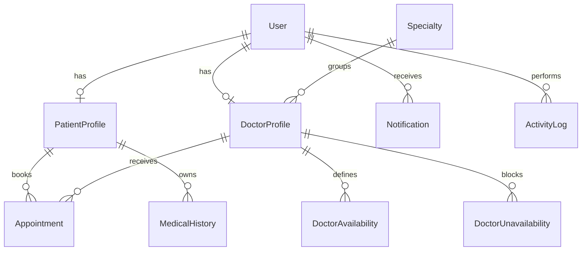

# Base de données — MediBook SaaS

## 1. Objectif du document

Ce document décrit un schéma de base de données complet et professionnel pour le projet **MediBook SaaS**, une plateforme SaaS de gestion des rendez-vous médicaux.

Le schéma est conçu pour une application fullstack utilisant :

- PostgreSQL
- Prisma ORM
- Node.js / Express
- JWT avec rôles
- Frontend React / Next.js

---

## 2. Entités principales proposées

Le schéma professionnel proposé contient les entités suivantes :

| Entité | Rôle |
|---|---|
| User | Compte de connexion commun à tous les utilisateurs |
| PatientProfile | Informations propres au patient |
| DoctorProfile | Informations professionnelles du médecin |
| Specialty | Spécialités médicales |
| DoctorAvailability | Disponibilités hebdomadaires des médecins |
| DoctorUnavailability | Absences, congés ou indisponibilités ponctuelles |
| Appointment | Rendez-vous médicaux |
| MedicalHistory | Antécédents médicaux du patient |
| Notification | Notifications envoyées aux utilisateurs |
| ActivityLog | Historique des actions sensibles |
| Setting | Paramètres globaux de la plateforme |

---

## 3. Enums recommandés

### UserRole

```prisma
enum UserRole {
  ADMIN
  DOCTOR
  PATIENT
}
```

### UserStatus

```prisma
enum UserStatus {
  ACTIVE
  SUSPENDED
  INACTIVE
}
```

### AppointmentStatus

```prisma
enum AppointmentStatus {
  PENDING
  CONFIRMED
  CANCELLED
  COMPLETED
  NO_SHOW
}
```

### NotificationType

```prisma
enum NotificationType {
  APPOINTMENT_CONFIRMATION
  APPOINTMENT_CANCELLATION
  APPOINTMENT_REMINDER
  SYSTEM
}
```

### NotificationChannel

```prisma
enum NotificationChannel {
  EMAIL
  SMS
  SYSTEM
}
```

### DayOfWeek

```prisma
enum DayOfWeek {
  MONDAY
  TUESDAY
  WEDNESDAY
  THURSDAY
  FRIDAY
  SATURDAY
  SUNDAY
}
```

---

## 4. Schéma relationnel global



---

## 5. Tables détaillées

## 5.1 Table `users`

Cette table contient les informations de connexion communes à tous les utilisateurs.

| Colonne | Type | Contraintes | Description |
|---|---|---|---|
| id | UUID | PK | Identifiant unique |
| firstName | String | Required | Prénom |
| lastName | String | Required | Nom |
| email | String | Unique, Required | Adresse email |
| password | String | Required | Mot de passe hashé |
| phone | String | Optional | Téléphone |
| role | UserRole | Required | ADMIN, DOCTOR ou PATIENT |
| status | UserStatus | Default ACTIVE | Statut du compte |
| lastLoginAt | DateTime | Optional | Dernière connexion |
| createdAt | DateTime | Default now() | Date de création |
| updatedAt | DateTime | Auto update | Date de modification |
| deletedAt | DateTime | Optional | Soft delete |

### Règles métier

- L’email doit être unique.
- Le mot de passe doit être hashé avant stockage.
- Un utilisateur suspendu ne peut pas se connecter.
- La suppression doit être logique avec `deletedAt`.

---

## 5.2 Table `patient_profiles`

Cette table contient les informations spécifiques aux patients.

| Colonne | Type | Contraintes | Description |
|---|---|---|---|
| id | UUID | PK | Identifiant unique |
| userId | UUID | FK, Unique | Référence vers User |
| dateOfBirth | DateTime | Optional | Date de naissance |
| gender | String | Optional | Genre |
| address | String | Optional | Adresse |
| city | String | Optional | Ville |
| postalCode | String | Optional | Code postal |
| emergencyContactName | String | Optional | Contact d’urgence |
| emergencyContactPhone | String | Optional | Téléphone d’urgence |
| insuranceNumber | String | Optional | Numéro d’assurance |
| createdAt | DateTime | Default now() | Date de création |
| updatedAt | DateTime | Auto update | Date de modification |

### Règles métier

- Un patient possède un seul profil patient.
- Un utilisateur avec le rôle `PATIENT` doit avoir un `PatientProfile`.

---

## 5.3 Table `specialties`

Cette table contient les spécialités médicales.

| Colonne | Type | Contraintes | Description |
|---|---|---|---|
| id | UUID | PK | Identifiant unique |
| name | String | Unique, Required | Nom de la spécialité |
| description | String | Optional | Description |
| isActive | Boolean | Default true | Spécialité active ou non |
| createdAt | DateTime | Default now() | Date de création |
| updatedAt | DateTime | Auto update | Date de modification |

### Exemples

- Médecine générale
- Cardiologie
- Dermatologie
- Pédiatrie
- Gynécologie

---

## 5.4 Table `doctor_profiles`

Cette table contient les informations professionnelles des médecins.

| Colonne | Type | Contraintes | Description |
|---|---|---|---|
| id | UUID | PK | Identifiant unique |
| userId | UUID | FK, Unique | Référence vers User |
| specialtyId | UUID | FK | Référence vers Specialty |
| licenseNumber | String | Unique, Required | Numéro de licence médicale |
| bio | String | Optional | Biographie professionnelle |
| consultationFee | Decimal | Optional | Frais de consultation |
| clinicAddress | String | Optional | Adresse de consultation |
| yearsOfExperience | Int | Optional | Années d’expérience |
| isAvailable | Boolean | Default true | Disponibilité générale |
| maxAppointmentsPerDay | Int | Default 20 | Limite quotidienne |
| createdAt | DateTime | Default now() | Date de création |
| updatedAt | DateTime | Auto update | Date de modification |

### Règles métier

- Un médecin possède un seul profil médecin.
- Un médecin doit être lié à une spécialité.
- Un médecin suspendu ne peut pas recevoir de nouveaux rendez-vous.
- Le numéro de licence doit être unique.

---

## 5.5 Table `doctor_availabilities`

Cette table définit les disponibilités régulières des médecins.

| Colonne | Type | Contraintes | Description |
|---|---|---|---|
| id | UUID | PK | Identifiant unique |
| doctorId | UUID | FK | Référence vers DoctorProfile |
| dayOfWeek | DayOfWeek | Required | Jour de la semaine |
| startTime | String | Required | Heure de début |
| endTime | String | Required | Heure de fin |
| isActive | Boolean | Default true | Disponibilité active |
| createdAt | DateTime | Default now() | Date de création |
| updatedAt | DateTime | Auto update | Date de modification |

### Exemple

Un médecin peut être disponible :

- lundi de 09:00 à 12:00 ;
- lundi de 13:00 à 17:00 ;
- mercredi de 10:00 à 15:00.

---

## 5.6 Table `doctor_unavailabilities`

Cette table enregistre les absences ou indisponibilités ponctuelles.

| Colonne | Type | Contraintes | Description |
|---|---|---|---|
| id | UUID | PK | Identifiant unique |
| doctorId | UUID | FK | Référence vers DoctorProfile |
| startDateTime | DateTime | Required | Début de l’indisponibilité |
| endDateTime | DateTime | Required | Fin de l’indisponibilité |
| reason | String | Optional | Raison |
| createdAt | DateTime | Default now() | Date de création |
| updatedAt | DateTime | Auto update | Date de modification |

### Règles métier

- Aucun rendez-vous ne peut être créé pendant une indisponibilité.
- Les rendez-vous existants doivent être annulés ou déplacés si une indisponibilité est ajoutée.

---

## 5.7 Table `appointments`

Cette table contient les rendez-vous médicaux.

| Colonne | Type | Contraintes | Description |
|---|---|---|---|
| id | UUID | PK | Identifiant unique |
| patientId | UUID | FK | Référence vers PatientProfile |
| doctorId | UUID | FK | Référence vers DoctorProfile |
| startDateTime | DateTime | Required | Date et heure de début |
| endDateTime | DateTime | Required | Date et heure de fin |
| status | AppointmentStatus | Default PENDING | Statut du rendez-vous |
| reason | String | Optional | Motif du rendez-vous |
| notes | String | Optional | Notes internes |
| cancellationReason | String | Optional | Motif d’annulation |
| cancelledAt | DateTime | Optional | Date d’annulation |
| completedAt | DateTime | Optional | Date de finalisation |
| createdAt | DateTime | Default now() | Date de création |
| updatedAt | DateTime | Auto update | Date de modification |

### Règles métier

- Un patient doit être connecté pour réserver.
- Un rendez-vous ne peut pas être dans le passé.
- Un médecin ne peut pas avoir deux rendez-vous au même moment.
- Un patient ne peut modifier que ses propres rendez-vous.
- Un médecin ne peut gérer que ses propres rendez-vous.
- Un administrateur peut gérer tous les rendez-vous.
- Un rendez-vous annulé doit conserver son historique.

---

## 5.8 Table `medical_histories`

Cette table contient les informations médicales liées aux patients.

| Colonne | Type | Contraintes | Description |
|---|---|---|---|
| id | UUID | PK | Identifiant unique |
| patientId | UUID | FK | Référence vers PatientProfile |
| allergies | String | Optional | Allergies connues |
| chronicDiseases | String | Optional | Maladies chroniques |
| currentMedications | String | Optional | Médicaments actuels |
| surgeries | String | Optional | Chirurgies passées |
| familyHistory | String | Optional | Antécédents familiaux |
| notes | String | Optional | Notes médicales |
| createdAt | DateTime | Default now() | Date de création |
| updatedAt | DateTime | Auto update | Date de modification |

### Règles métier

- Le dossier médical appartient à un patient.
- L’accès doit être strictement contrôlé.
- Le patient peut consulter ses propres informations.
- Le médecin peut consulter seulement les patients liés à ses rendez-vous.

---

## 5.9 Table `notifications`

Cette table contient les notifications envoyées aux utilisateurs.

| Colonne | Type | Contraintes | Description |
|---|---|---|---|
| id | UUID | PK | Identifiant unique |
| userId | UUID | FK | Destinataire |
| type | NotificationType | Required | Type de notification |
| channel | NotificationChannel | Required | Email, SMS ou système |
| title | String | Required | Titre |
| message | String | Required | Message |
| isRead | Boolean | Default false | Notification lue ou non |
| sentAt | DateTime | Optional | Date d’envoi |
| createdAt | DateTime | Default now() | Date de création |

### Règles métier

- Une notification est créée après réservation, annulation ou rappel.
- Une notification peut être affichée dans le tableau de bord.
- Les rappels peuvent être envoyés 24h ou 2h avant le rendez-vous.

---

## 5.10 Table `activity_logs`

Cette table conserve l’historique des actions sensibles.

| Colonne | Type | Contraintes | Description |
|---|---|---|---|
| id | UUID | PK | Identifiant unique |
| userId | UUID | FK Optional | Utilisateur concerné |
| action | String | Required | Action effectuée |
| entity | String | Optional | Entité touchée |
| entityId | String | Optional | Identifiant de l’entité |
| ipAddress | String | Optional | Adresse IP |
| userAgent | String | Optional | Navigateur/appareil |
| metadata | Json | Optional | Détails supplémentaires |
| createdAt | DateTime | Default now() | Date de création |

### Actions à journaliser

- Connexion
- Déconnexion
- Création de rendez-vous
- Annulation de rendez-vous
- Suppression logique d’utilisateur
- Suspension de compte
- Modification de paramètres système

---

## 5.11 Table `settings`

Cette table stocke les paramètres globaux de la plateforme.

| Colonne | Type | Contraintes | Description |
|---|---|---|---|
| id | UUID | PK | Identifiant unique |
| key | String | Unique, Required | Clé du paramètre |
| value | String | Required | Valeur |
| description | String | Optional | Description |
| createdAt | DateTime | Default now() | Date de création |
| updatedAt | DateTime | Auto update | Date de modification |

### Exemples de paramètres

| key | value |
|---|---|
| platform_name | MediBook SaaS |
| default_language | fr |
| default_timezone | America/Toronto |
| appointment_duration_minutes | 30 |
| jwt_expiration | 24h |

---

## 6. Prisma schema recommandé

```prisma
generator client {
  provider = "prisma-client-js"
}

datasource db {
  provider = "postgresql"
}

enum UserRole {
  ADMIN
  DOCTOR
  PATIENT
}

enum UserStatus {
  ACTIVE
  SUSPENDED
  INACTIVE
}

enum AppointmentStatus {
  PENDING
  CONFIRMED
  CANCELLED
  COMPLETED
  NO_SHOW
}

enum NotificationType {
  APPOINTMENT_CONFIRMATION
  APPOINTMENT_CANCELLATION
  APPOINTMENT_REMINDER
  SYSTEM
}

enum NotificationChannel {
  EMAIL
  SMS
  SYSTEM
}

enum DayOfWeek {
  MONDAY
  TUESDAY
  WEDNESDAY
  THURSDAY
  FRIDAY
  SATURDAY
  SUNDAY
}

model User {
  id           String      @id @default(uuid())
  firstName    String
  lastName     String
  email        String      @unique
  password     String
  phone        String?
  role         UserRole
  status       UserStatus  @default(ACTIVE)
  lastLoginAt  DateTime?
  createdAt    DateTime    @default(now())
  updatedAt    DateTime    @updatedAt
  deletedAt    DateTime?

  patientProfile PatientProfile?
  doctorProfile  DoctorProfile?
  notifications  Notification[]
  activityLogs   ActivityLog[]

  @@index([role])
  @@index([status])
}

model PatientProfile {
  id                    String   @id @default(uuid())
  userId                String   @unique
  dateOfBirth            DateTime?
  gender                String?
  address               String?
  city                  String?
  postalCode            String?
  emergencyContactName  String?
  emergencyContactPhone String?
  insuranceNumber       String?
  createdAt             DateTime @default(now())
  updatedAt             DateTime @updatedAt

  user            User             @relation(fields: [userId], references: [id])
  appointments    Appointment[]
  medicalHistory  MedicalHistory?

  @@index([city])
}

model Specialty {
  id          String   @id @default(uuid())
  name        String   @unique
  description String?
  isActive    Boolean  @default(true)
  createdAt   DateTime @default(now())
  updatedAt   DateTime @updatedAt

  doctors DoctorProfile[]
}

model DoctorProfile {
  id                    String   @id @default(uuid())
  userId                String   @unique
  specialtyId            String
  licenseNumber          String   @unique
  bio                   String?
  consultationFee        Decimal?
  clinicAddress          String?
  yearsOfExperience      Int?
  isAvailable            Boolean  @default(true)
  maxAppointmentsPerDay  Int      @default(20)
  createdAt              DateTime @default(now())
  updatedAt              DateTime @updatedAt

  user              User                   @relation(fields: [userId], references: [id])
  specialty         Specialty              @relation(fields: [specialtyId], references: [id])
  availabilities    DoctorAvailability[]
  unavailabilities  DoctorUnavailability[]
  appointments      Appointment[]

  @@index([specialtyId])
  @@index([isAvailable])
}

model DoctorAvailability {
  id          String    @id @default(uuid())
  doctorId    String
  dayOfWeek   DayOfWeek
  startTime   String
  endTime     String
  isActive    Boolean   @default(true)
  createdAt   DateTime  @default(now())
  updatedAt   DateTime  @updatedAt

  doctor DoctorProfile @relation(fields: [doctorId], references: [id])

  @@index([doctorId])
  @@index([dayOfWeek])
}

model DoctorUnavailability {
  id            String   @id @default(uuid())
  doctorId      String
  startDateTime DateTime
  endDateTime   DateTime
  reason        String?
  createdAt     DateTime @default(now())
  updatedAt     DateTime @updatedAt

  doctor DoctorProfile @relation(fields: [doctorId], references: [id])

  @@index([doctorId])
  @@index([startDateTime, endDateTime])
}

model Appointment {
  id                 String            @id @default(uuid())
  patientId           String
  doctorId            String
  startDateTime       DateTime
  endDateTime         DateTime
  status              AppointmentStatus @default(PENDING)
  reason              String?
  notes               String?
  cancellationReason  String?
  cancelledAt         DateTime?
  completedAt         DateTime?
  createdAt           DateTime          @default(now())
  updatedAt           DateTime          @updatedAt

  patient PatientProfile @relation(fields: [patientId], references: [id])
  doctor  DoctorProfile  @relation(fields: [doctorId], references: [id])

  @@index([patientId])
  @@index([doctorId])
  @@index([status])
  @@index([startDateTime])
  @@unique([doctorId, startDateTime, endDateTime])
}

model MedicalHistory {
  id                  String   @id @default(uuid())
  patientId            String   @unique
  allergies            String?
  chronicDiseases      String?
  currentMedications   String?
  surgeries            String?
  familyHistory        String?
  notes                String?
  createdAt            DateTime @default(now())
  updatedAt            DateTime @updatedAt

  patient PatientProfile @relation(fields: [patientId], references: [id])
}

model Notification {
  id        String              @id @default(uuid())
  userId    String
  type      NotificationType
  channel   NotificationChannel
  title     String
  message   String
  isRead    Boolean             @default(false)
  sentAt    DateTime?
  createdAt DateTime            @default(now())

  user User @relation(fields: [userId], references: [id])

  @@index([userId])
  @@index([isRead])
  @@index([createdAt])
}

model ActivityLog {
  id        String   @id @default(uuid())
  userId    String?
  action    String
  entity    String?
  entityId  String?
  ipAddress String?
  userAgent String?
  metadata  Json?
  createdAt DateTime @default(now())

  user User? @relation(fields: [userId], references: [id])

  @@index([userId])
  @@index([action])
  @@index([createdAt])
}

model Setting {
  id          String   @id @default(uuid())
  key         String   @unique
  value       String
  description String?
  createdAt   DateTime @default(now())
  updatedAt   DateTime @updatedAt
}
```

---

## 7. Contraintes et indexes recommandés

### Contraintes uniques

| Table | Contrainte |
|---|---|
| users | email unique |
| patient_profiles | userId unique |
| doctor_profiles | userId unique |
| doctor_profiles | licenseNumber unique |
| specialties | name unique |
| settings | key unique |
| appointments | doctorId + startDateTime + endDateTime unique |

### Indexes importants

| Table | Index |
|---|---|
| users | role |
| users | status |
| doctor_profiles | specialtyId |
| doctor_profiles | isAvailable |
| appointments | patientId |
| appointments | doctorId |
| appointments | status |
| appointments | startDateTime |
| notifications | userId |
| notifications | isRead |
| activity_logs | userId |
| activity_logs | createdAt |
