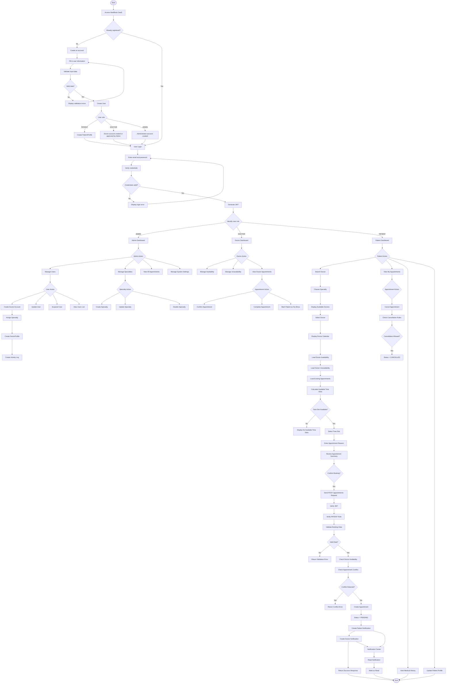

# MediBook SaaS - Complete Activity Diagram

## Overview

This activity diagram represents the complete workflow of the MediBook SaaS platform, including:

* Authentication & Authorization
* User Registration
* Patient Management
* Doctor Management
* Appointment Booking
* Appointment Cancellation
* Availability Management
* Notifications
* Medical History
* Administrative Operations

---

## Mermaid Activity Diagram



---

## Main Business Processes

### Authentication

* User Registration
* User Login
* JWT Authentication
* Role-Based Access Control (RBAC)

### Administration

* User Management
* Doctor Management
* Specialty Management
* System Configuration
* Appointment Monitoring

### Doctor Management

* Availability Management
* Unavailability Management
* Appointment Confirmation
* Consultation Completion

### Appointment Management

* Doctor Search
* Appointment Booking
* Appointment Cancellation
* Conflict Detection
* Appointment Status Tracking

### Notifications

* Booking Confirmation
* Appointment Cancellation
* Appointment Updates
* Notification Center

### Patient Features

* Profile Management
* Appointment History
* Medical History
* Appointment Scheduling

```
```
